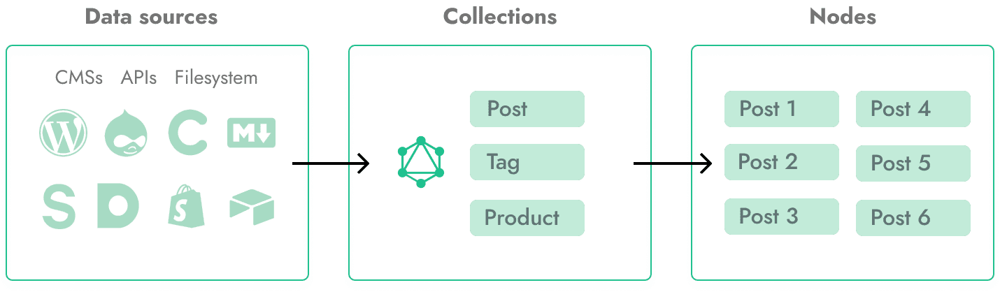

# Gridsome 基础

## 目录结构

```shell
.
├── package.json # 包说明文件
├── gridsome.config.js # Gridsome 配置文件
├── gridsome.server.js # 自定义 Gridsome 编译
├── static/ # 静态资源存储目录，该目录中的资源不做构建处理
└── src/
    ├── main.js # 应用入口
    ├── index.html # 公共页面
    ├── App.vue # 根组件
    ├── layouts/ # 布局组件
    │   └── Default.vue
    ├── pages/ # 路由页面
    │   ├── Index.vue
    │   └── Blog.vue
    └── templates/ # 模板
        └── BlogPost.vue
```


## 项目配置

Gridsome需要 gridsome.config.js 才能工作。插件和项目设置位于此处。基本配置文件如下所示：

```js
module.exports = {
  siteName: 'Gridsome',
  siteUrl: 'https://www.gridsome.org',
  plugins: []
}

```

| 属性                     | 类型               | 默认值                | 说明                                                         |
| ------------------------ | ------------------ | --------------------- | ------------------------------------------------------------ |
| siteName                 | string             | `<dirname>`           | 该名称通常在标题标签中使用。                                 |
| siteDescription          | string             | `''`                  | 页面描述，`<meta name="description" content="xxx">`          |
| pathPrefix               | string             | `''`                  | Gridsome假定您的项目是从域的根目录提供的。如果您的项目将托管在名为my-app的子目录中，则将此选项更改为“ / my-app”。 |
| titleTemplate            | string             | `%s - <siteName>`     | 设置标题标签的模板。 ％s占位符将替换为您在页面中设置的metaInfo的标题。 |
| plugins                  | Array              | `[]`                  | 通过将插件添加到plugins数组来激活插件。                      |
| templates                | object             | `{}`                  | 定义 collections 的路由和模板。                              |
| metadata                 | object             | `{}`                  | 将全局元数据添加到GraphQL模式。                              |
| icon                     | string \| object   | `'./src/favicon.png'` | Gridsome默认情况下会将位于src / favicon.png的任何图像用作favicon和touchicon，但您可以定义其他路径或大小等。图标应为正方形且至少16个像素。网站图标将调整为16、32、96像素。默认情况下，触摸图标的大小将调整为76、152、120、167、180像素。 |
| configureWebpack         | object \| Function |                       | 如果该选项是一个对象，它将与内部配置合并。                   |
| chainWebpack             | Function           |                       | 该函数将接收由webpack-chain驱动的ChainableConfig实例。       |
| runtimeCompiler          | boolean            | false                 | 在运行时包括Vue模板编译器。                                  |
| configureServer          | Function           |                       | 配置开发服务器。                                             |
| permalinks.trailingSlash | boolean            | true                  | 默认情况下，在页面和模板后添加斜杠。启用此选项后，具有动态路由的页面将不包含尾部斜杠，并且服务器上必须具有额外的重写规则才能正常工作。另外，<g-link>的静态路径不会自动包含尾部斜杠，而应包含在路径中： |
| permalinks.slugify       |                    |                       | 使用自定义的Slugify方法。默认是 [@sindresorhus/slugify](https://github.com/sindresorhus/slugify) |
| css.split                | boolean            | false                 | 将CSS分成多个块。默认情况下禁用拆分。拆分CSS可能会导致奇怪的行为。 |
| css.loaderOptions        | Object             | {}                    | 将选项传递给与CSS相关的 loader                               |
| host                     | string             | localhost             |                                                              |
| port                     | number             | 8080                  |                                                              |
| outputDir                | string             | `‘dist’`              | 运行gridsome构建时将在其中生成生产构建文件的目录。           |

插件示例：

```js
module.exports = {
  plugins: [
    {
      use: '@gridsome/source-filesystem',
      options: {
        path: 'blog/**/*.md',
        route: '/blog/:year/:month/:day/:slug',
        typeName: 'Post'
      }
    }
  ]
}

```


注意事项：

- 开发过程中修改配置需要重启服务

## Pages 页面

页面负责在URL上显示您的数据。每个页面将静态生成，并具有自己的带有标记的index.html文件。

在Gridsome中创建页面有两种选择：

- 单文件组件
- 使用 Pages API 以编程方式创建页面

### pages 中的单文件组件

`src/pages` 目录中的单文件组件将自动具有其自己的URL。文件路径用于生成 URL，以下是一些基本示例：

- `src/pages/Index.vue` becomes `/`*(The frontpage)*
- `src/pages/AboutUs.vue` becomes `/about-us/`
- `src/pages/about/Vision.vue` becomes `/about/vision/`
- `src/pages/blog/Index.vue` becomes `/blog/`

> 大小自动转小写，驼峰命名会自动使用短横杠分割

src/pages 中的页面通常用于诸如 /about/ 之类的固定 URL，或用于在 /blog/ 等处列出博客文章。

### 使用 Pages API 创建页面

可以使用 `gridsome.server.js` 中的 `createPages` 钩子以编程方式创建页面。如果您要从外部 API 手动创建页面而不使用 GraphQL 数据层，则此功能很有用。

```js
module.exports = function (api) {
  api.createPages(({ createPage }) => {
    createPage({
      path: '/my-page',
      component: './src/templates/MyPage.vue'
    })
  })
}

```


### 动态路由

动态路由对于仅需要客户端路由的页面很有用。例如，根据URL中的细分从生产环境中的外部API获取信息的页面。

#### 通过文件创建动态路由

动态页面用于客户端路由。可以通过将名称包装在方括号中来将路由参数放置在文件和目录名称中。例如：

- `src/pages/user/[id].vue` becomes `/user/:id`.
- `src/pages/user/[id]/settings.vue` becomes `/user/:id/settings`.


注意事项：

- 在构建时，这将生成 `user/_id.html` 和 `user/_id/settings.html`，并且您必须具有重写规则以使其正常运行。

- 具有动态路由的页面的优先级低于固定路由。例如，如果您有一个 `/user/create` 路由和 `/user/:id` 路由，则 `/user/create` 路由将具有优先级。


这是一个基本的页面组件，它使用路由中的id参数来获取客户端的用户信息：


```html
<template>
  <div v-if="user">
    <h1>{{ user.name }}</h1>
  </div>
</template>

<script>
export default {
  data() {
    return {
      user: null
    }
  },
  async mounted() {
    const { id } = this.$route.params
    const response = await fetch(`https://api.example.com/user/${id}`)

    this.user = await response.json()
  }
}
</script>
```

始终使用 `mounted` 来获取客户端数据。由于在生成静态HTML时执行数据，因此在 `created` 中获取数据会引起问题。


#### 通过编程方式创建动态路由

以编程方式创建带有动态路由的页面，以获取更高级的路径。动态参数使用 `:` 来指定。

每个参数都可以具有一个自定义的正则表达式，以仅匹配数字或某些值。

```js
module.exports = function (api) {
  api.createPages(({ createPage }) => {
    createPage({
      path: '/user/:id(\\d+)',
      component: './src/templates/User.vue'
    })
  })
}

```

#### 生成重写规则

Gridsome无法为动态路由的每种可能的变体生成HTML文件，这意味着直接访问URL时最有可能显示404页。而是，Gridsome生成一个HTML文件，该文件可用于重写规则。例如，类似/ user /：id的路由将生成位于/user/_id.html的HTML文件。您可以具有重写规则，以将所有与/ user /：id匹配的路径映射到该文件。

由于每种服务器类型都有自己的语法，因此必须手动生成重写规则。 afterBuild 挂钩中的 redirects 数组包含应生成的所有必要的重写规则。

```js
const fs = require('fs')

module.exports = {
  afterBuild ({ redirects }) {
    for (const rule of redirects) {
      // rule.from   - The dynamic path
      // rule.to     - The HTML file path
      // rule.status - 200 if rewrite rule
    }
  }
}

```


### 页面 meta 信息

Gridsome 使用 [vue-meta](https://vue-meta.nuxtjs.org/) 处理有关页面的元信息。

```html
<template>
  <div>
    <h1>Hello, world!</h1>
  </div>
</template>

<script>
export default {
  metaInfo: {
    title: 'Hello, world!',
    meta: [
      { name: 'author', content: 'John Doe' }
    ]
  }
}
</script>
```


### 自定义 404 页面

创建一个 `src/pages/404.vue` 组件以具有一个自定义 404 页面。


## Collections 集合

集合是一组节点，每个节点都包含带有自定义数据的字段。如果您要在网站上放置博客文章，标签，产品等，则集合很有用。

### 添加集合

集合可以通过 [source plugins](https://gridsome.org/plugins/) 添加，也可以使用 [Data Store API](https://gridsome.org/docs/data-store-api/) 自己添加。

在开发和构建期间，这些集合存储在本地内存数据存储中。节点可以来自本地文件（Markdown，JSON，YAML等）或任何外部API。



### 使用 source plugins 添加集合

将集合添加到 Gridsome 的最简单方法是使用源插件。本示例从 WordPress 网站创建集合。源插件的 typeName 选项通常用于为插件添加的集合名称添加前缀。

```js
// gridsome.config.js
module.exports = {
  plugins: [
    {
      use: '@gridsome/source-wordpress',
      options: {
        baseUrl: 'YOUR_WEBSITE_URL',
        typeName: 'WordPress',
      }
    }
  ]
}
```

你可以在[这里](https://gridsome.org/plugins)浏览插件列表。

### 使用 Data Store API 添加集合

您可以从任何外部 API 手动添加集合。

本示例创建一个名为 Post 的集合，该集合从 API 获取内容并将结果作为节点添加到该集合中。

```js
// gridsome.server.js
const axios = require('axios')

module.exports = function (api) {
  api.loadSource(async actions => {
    const collection = actions.addCollection('Post')

    const { data } = await axios.get('https://api.example.com/posts')

    for (const item of data) {
      collection.addNode({
        id: item.id,
        title: item.title,
        content: item.content
      })
    }
  })
}
```

了解有关 [Data Store API](https://gridsome.org/docs/data-store-api/) 的更多信息。

### GraphQL 中的集合

每个集合将向 [GraphQL schema](https://gridsome.org/docs/data-layer/) 添加两个根字段，这些根字段用于检索页面中的节点。

字段名称是根据集合名称自动生成的。如果您将集合命名为 Post，那么在架构中将具有以下可用字段：

- `post` 通过 ID 获取单个节点。
- `allPost` 获取节点列表（可以排序和过滤等）。


**自动生成 schema**


**探索可用的类型和字段**

您可以通过在 [GraphQL 资源管理器](https://gridsome.org/docs/data-layer#the-graphql-explorer)中打开架构选项卡来浏览可用字段。

阅读有关如何在 GraphQL 中查询节点的更多信息：https://gridsome.org/docs/querying-data/。

### 集合模板

模板用于为集合中的节点创建单个页面。节点需要相应的页面才能显示在其自己的URL上。


## Templates

模板用于为集合中的节点创建单个页面。节点需要相应的页面才能显示在其自己的URL上。

### 设置模板


### 将数据添加到模板

### 节点字段作为 meta info


## Layouts

## Components

## Linking

## 动态路由

## 图片处理

## 页面 Head 管理

### 添加全局头部元数据

### 将 meta data 添加到 pages 和 templates

### 从子组件覆盖 meta data

### 可用属性

| Property      | Description        | Link                                                   |
| :------------ | :----------------- | :----------------------------------------------------- |
| style         | Adds a style tag   | [Docs](https://vue-meta.nuxtjs.org/api/#style)         |
| script        | Adds a script tag  | [Docs](https://vue-meta.nuxtjs.org/api/#script)        |
| meta          | Adds a meta tag    | [Docs](https://vue-meta.nuxtjs.org/api/#meta)          |
| title         | Changes title text | [Docs](https://vue-meta.nuxtjs.org/api/#title)         |
| titleTemplate | Dynamic title text | [Docs](https://vue-meta.nuxtjs.org/api/#titletemplate) |
| link          | Adds a link tag    | [Docs](https://vue-meta.nuxtjs.org/api/#link)          |

## 环境变量


