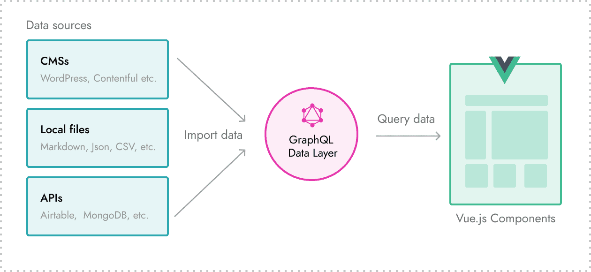
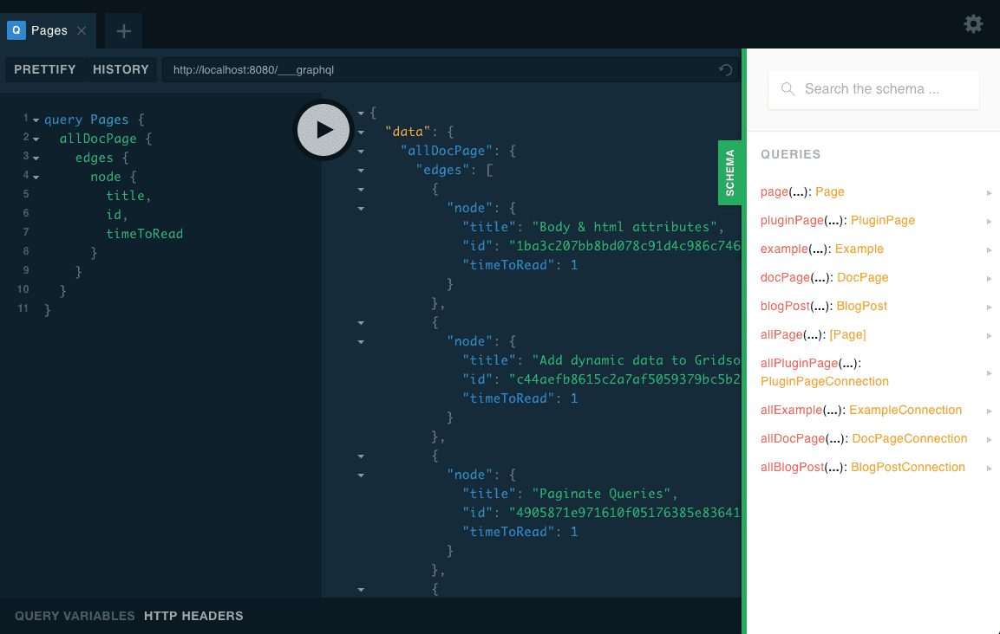

# 处理数据

[上一篇](https://blog.crimx.com/2019/04/18/搭建-gatsby-博客一：为什么选-gatsby/)介绍了选择 Gatsby 的原因，其中提到了 Gatsby 使用 GraphQL 。大家可能会有疑惑，不是建静态博客么，怎么会有 GraphQL？难道还要部署服务器？

其实这里 GraphQL 并不是作为服务器端部署，而是作为 Gridsome 在本地管理资源的一种方式。

通过 GraphQL 统一管理实际上非常方便，因为作为一个数据库查询语言，它有非常完备的查询语句，与 JSON 相似的描述结构，再结合 Relay 的 Connections 方式处理集合，管理资源不再需要自行引入其它项目，大大减轻了维护难度。

## GraphQL数据层



GraphQL数据层是在开发模式下可用的工具。这是临时存储到 Gridsome 项目中的所有数据的地方。可以将其视为可帮助您更快更好地处理数据的本地数据库。

来自 GraphQL 数据层的数据将生成为静态内容。

数据层和导入数据的源之间没有实时连接。这意味着您需要重新生成网站以获取最新的数据更新。

如果需要动态数据，则应使用[客户端数据](https://gridsome.org/docs/client-side-data/)。

> 提示：默认情况下，Pages 也 Site metadata 已添加到数据层。


### 处理数据

- [How to import data](https://gridsome.org/docs/fetching-data/).
- [How to query data](https://gridsome.org/docs/querying-data/).
- [How to filter data](https://gridsome.org/docs/filtering-data/).
- [How to create taxonomy pages](https://gridsome.org/docs/taxonomies/).
- [How to paginate data](https://gridsome.org/docs/pagination/).
- [How to add client-side / dynamic data](https://gridsome.org/docs/client-side-data/).

### GraphQL资源管理器

每个 Gridsome 项目都有一个 GraphQL 资源管理器，可以在开发模式下使用它来探索和测试查询。

在这里，您还将获得所有可用 GraphQL 集合的列表。

通常可以通过转到 `http:// localhost:8080/___explore` 来打开它。




## 导入数据

Gridsome 使您可以将数据从任何数据源导入 GraphQL 数据层。

### 使用 source plugins

### 使用外部 API

### 使用本地文件

#### Markdown

#### Images

#### YAML

#### CSV

#### JSON


## 查询数据

您可以将数据从GraphQL数据层查询到任何页面，模板或组件中。在Vue组件中，使用 `<page-query>` 或 `<static-query>` 块添加查询。

- 在 Pages 和 Templates 中使用 `<page-query>`
- 在 Components 中使用 `<static-query>`

### 如何使用 GraphQL 查询

在 Gridsome 中使用 GraphQL 很容易，并且您不需要了解 GraphQL。

这是一个如何在页面的 `page-query` 中使用GraphQL的示例：

```html
<template>
  <div>
    <div v-for="edge in $page.posts.edges" :key="edge.node.id">
      <h2>{{ edge.node.title }}</h2>
    </div>
  </div>
</template>

<page-query>
query {
  posts: allWordPressPost {
    edges {
      node {
        id
        title
      }
    }
  }
}
</page-query>
```

**使用 GraphQL，您仅查询所需的数据。**这使得处理数据更加容易和整洁。

- 查询总是从 `query` 开始
- 然后是 `Posts`（可以是任何东西）
- 然后写一些内容例如 `posts: allWordPressPost`。
- `allWordPressPost` 是您要查询的GraphQL集合的名称。 
- `posts:` 部分是可选的别名。
- 使用 `posts` 作为别名时，您的数据将位于 `$page.posts`（如果使用 `<static-query>`，则为 `$static.posts`）。否则，它将在 `$page.allWordPressPost` 上可用。

学习更多关于 GraphQL 查询的内容：https://graphql.org/learn/queries/。


## 数据过滤

## 页面分类

## 页面分页

## 全局 metadata

## 客户端数据


