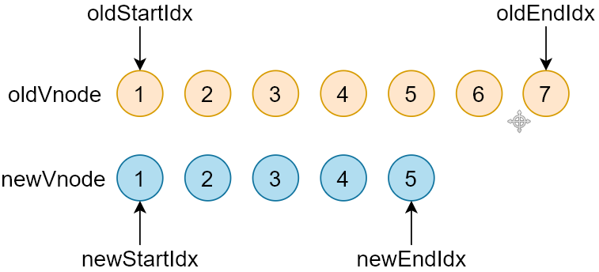

# 反馈问题

- 希望对比一下Vue3和Vue2除核心实现原理外的其他差异
- 作业中实现v-on不太理解
- 希望再归纳一下diff的执行

- Snabbdom 案例
  - https://codesandbox.io/s/snabbdom-demo-4hbyb
  - https://codesandbox.io/s/snabbdom-demo-forked-7vpmf
    - https://github.com/snabbdom/snabbdom#the-style-module
  - 官方示例：https://github.com/snabbdom/snabbdom/blob/master/examples/hero/index.js

## 面试题

```js
function fn1 () {
  console.log(1)
}
function fn2 () {
  console.log(2)
}
// fn1.call(fn2)       
// fn1.call.call(fn2)


Function.prototype.mycall = function (context, ...args) {
  context = context || window
  // 记录当前调用 mycall 的函数
  context.fn = this
  // 谁调用 fn，函数内部的this就指向谁
  const result = context.fn(...args)
  delete context.fn
  return result
}


fn1.mycall(fn2)
fn1.mycall.mycall(fn2)
// ----------------------执行过程------------------------------
// fn1.mycall.mycall(fn2)，执行过程 
Function.prototype.mycall = function (context, ...args) {
  // context ---> fn2
  context = context || window
  // context.fn ---> this ----> mycall
  // fn2.mycall
  context.fn = this
  // 暂停，等待执行 fn2.mycall(没有参数)
  const result = context.fn(...args)
  delete context.fn
  return result
}

// 调用 fn2.mycall(没传参数)
Function.prototype.mycall = function (context, ...args) {
  // context ---> Window
  context = context || window
  // context.fn ---> this ---> fn2
  // Window.fn2
  context.fn = this
  // Window.fn2(没有参数)
  const result = context.fn(...args)
  delete context.fn
  return result
}
```

# 虚拟 DOM

- 使用 VNode 来描述真实 DOM
- 声明式渲染/响应式/状态驱动
- 跨平台
- 首次渲染的性能下降，界面复杂的情况更新视图会提供性能 

## No Virtual DOM

- svelte
- https://svelte.dev/
- https://github.com/sveltejs/svelte

## Diff 算法

O(1)  O(n)

对比两颗树上所有的节点，传统的方式使用依次比较两棵树的每一个节点，这样的时间复杂度是 O(n^3)。

比如：当前有三个节点，比较完树上的每一个节点需要的时间是 O(n^3)。其中 n 是节点个数。

100    1000000

3 * 3 * 3


- patch(oldVnode, newVnode)
- 打补丁，把新节点中变化的内容渲染到真实 DOM，最后返回新节点作为下一次处理的旧节点
- 对比新旧 VNode 是否相同节点(节点的 key 和 sel 相同)
- 如果不是相同节点，删除之前的内容，重新渲染
- 如果是相同节点，再判断新的 VNode 是否有 text，如果有并且和 oldVnode 的 text 不同，直接更新文本内容
- 如果新的 VNode 有 children，判断子节点是否有变化
- diff 过程只进行同层级比较，时间复杂度 O(n)
  - 100    100


### patch

- **功能：**

  - 传入新旧 VNode，对比差异，把差异渲染到 DOM
  - 返回新的 VNode，作为下一次 patch() 的 oldVnode

- **执行过程：**

  - 首先执行**模块**中的**钩子**函数 `pre`
  - 如果 oldVnode 和 vnode 相同（key 和 sel 相同）
    - 调用 patchVnode()，找节点的差异并更新 DOM
  - 如果 oldVnode 是 DOM 元素
    - 把 DOM 元素转换成 oldVnode
    - 调用 createElm() 把 vnode 转换为真实 DOM，记录到 vnode.elm
    - 把刚创建的 DOM 元素插入到 parent 中
    - 移除老节点
    - 触发**用户**设置的 `create ` **钩子**函数

- 源码位置：src/snabbdom.ts

  ```js
  export function init(modules: Array<Partial<Module>>, domApi?: DOMAPI) {
    return patch (oldVNode, vnode) {
      ……
      return vnode
    }
  }
  ```

  

  ```typescript
  return function patch(oldVnode: VNode | Element, vnode: VNode): VNode {
    let i: number, elm: Node, parent: Node;
    // 保存新插入节点的队列，为了触发钩子函数
    const insertedVnodeQueue: VNodeQueue = [];
    // 执行模块的 pre 钩子函数
    for (i = 0; i < cbs.pre.length; ++i) cbs.pre[i]();
  
    // 如果 oldVnode 不是 VNode，创建 VNode 并设置 elm 
    if (!isVnode(oldVnode)) {
      // 把 DOM 元素转换成空的 VNode
      oldVnode = emptyNodeAt(oldVnode);
    }
    // 如果新旧节点是相同节点(key 和 sel 相同)
    if (sameVnode(oldVnode, vnode)) {
      // 找节点的差异并更新 DOM
      patchVnode(oldVnode, vnode, insertedVnodeQueue);
    } else {
      // 如果新旧节点不同，vnode 创建对应的 DOM
      // 获取当前的 DOM 元素
      elm = oldVnode.elm!;
      parent = api.parentNode(elm);
      // 触发 init/create 钩子函数,创建 DOM
      createElm(vnode, insertedVnodeQueue);
  
      if (parent !== null) {
        // 如果父节点不为空，把 vnode 对应的 DOM 插入到文档中
        api.insertBefore(parent, vnode.elm!, api.nextSibling(elm));
        // 移除老节点
        removeVnodes(parent, [oldVnode], 0, 0);
      }
    }
    // 执行用户设置的 insert 钩子函数
    for (i = 0; i < insertedVnodeQueue.length; ++i) {
      insertedVnodeQueue[i].data!.hook!.insert!(insertedVnodeQueue[i]);
    }
    // 执行模块的 post 钩子函数
    for (i = 0; i < cbs.post.length; ++i) cbs.post[i]();
    // 返回 vnode
    return vnode;
  };
  ```

### patchVnode

- **功能：**

  - patchVnode(oldVnode, vnode, insertedVnodeQueue)
  - 对比 oldVnode 和 vnode 的差异，把差异渲染到 DOM 

- **执行过程：**

  - 首先执行**用户**设置的 **prepatch** **钩子**函数
  - 执行 create 钩子函数
    - 首先执行**模块**的 **create** **钩子**函数
    - 然后执行**用户**设置的 **create** **钩子**函数
  - 如果 **vnode.text** 未定义
    - 如果 `oldVnode.children` 和 `vnode.children` 都有值
      - 调用 `updateChildren()`
      - 使用 diff 算法对比子节点，更新子节点
    - 如果 `vnode.children` 有值，`oldVnode.children` 无值
      - 清空 DOM 元素
      - 调用 `addVnodes()`，批量添加子节点
    - 如果 `oldVnode.children` 有值，`vnode.children` 无值
      - 调用 `removeVnodes()`，批量移除子节点
    - 如果 **oldVnode.text** 有值
      - 清空 DOM 元素的内容
  - 如果设置了 `vnode.text` 并且和和 `oldVnode.text` 不等
    - 如果老节点有子节点，全部移除
    - 设置 DOM 元素的 `textContent` 为 `vnode.text`
  - 最后执行用户**设置的** **postpatch** **钩子**函数

- 源码位置：src/snabbdom.ts

  ```typescript
  function patchVnode(oldVnode: VNode, vnode: VNode, insertedVnodeQueue: VNodeQueue) {
    const hook = vnode.data?.hook;
    // 首先执行用户设置的 prepatch 钩子函数
    hook?.prepatch?.(oldVnode, vnode);
    const elm = vnode.elm = oldVnode.elm!;
    let oldCh = oldVnode.children as VNode[];
    let ch = vnode.children as VNode[];
    // 如果新老 vnode 相同返回
    if (oldVnode === vnode) return;
    if (vnode.data !== undefined) {
      // 执行模块的 update 钩子函数
      for (let i = 0; i < cbs.update.length; ++i) cbs.update[i](oldVnode, vnode);
      // 执行用户设置的 update 钩子函数
      vnode.data.hook?.update?.(oldVnode, vnode);
    }
    // 如果 vnode.text 未定义
    if (isUndef(vnode.text)) {
      // 如果新老节点都有 children
      if (isDef(oldCh) && isDef(ch)) {
        // 使用 diff 算法对比子节点，更新子节点
        if (oldCh !== ch) updateChildren(elm, oldCh, ch, insertedVnodeQueue);
      } else if (isDef(ch)) {
        // 如果新节点有 children，老节点没有 children
        // 如果老节点有text，清空dom 元素的内容
        if (isDef(oldVnode.text)) api.setTextContent(elm, '');
        // 批量添加子节点
        addVnodes(elm, null, ch, 0, ch.length - 1, insertedVnodeQueue);
      } else if (isDef(oldCh)) {
        // 如果老节点有children，新节点没有children
        // 批量移除子节点
        removeVnodes(elm, oldCh, 0, oldCh.length - 1);
      } else if (isDef(oldVnode.text)) {
        // 如果老节点有 text，清空 DOM 元素
        api.setTextContent(elm, '');
      }
    } else if (oldVnode.text !== vnode.text) {
      // 如果没有设置 vnode.text
      if (isDef(oldCh)) {
        // 如果老节点有 children，移除
        removeVnodes(elm, oldCh, 0, oldCh.length - 1);
      }
      // 设置 DOM 元素的 textContent 为 vnode.text
      api.setTextContent(elm, vnode.text!);
                         }
    // 最后执行用户设置的 postpatch 钩子函数
    hook?.postpatch?.(oldVnode, vnode);
  }
  ```


### updateChildren

- **功能：**

  - diff 算法的核心，对比新旧节点的 children，更新 DOM

- **执行过程：**

  - 要对比两棵树的差异，我们可以取第一棵树的每一个节点依次和第二课树的每一个节点比较，但是这样的时间复杂度为 O(n^3)
  - 在DOM 操作的时候我们很少很少会把一个父节点移动/更新到某一个子节点
  - 因此只需要找**同级别**的子**节点**依次**比较**，然后再找下一级别的节点比较，这样算法的时间复杂度为 O(n)

  

  - 在进行同级别节点比较的时候，首先会对新老节点数组的开始和结尾节点设置标记·索引，遍历的过程中移动索引
  - 在对**开始和结束节点**比较的时候，总共有四种情况
    - oldStartVnode / newStartVnode (旧开始节点 / 新开始节点)
    - oldEndVnode / newEndVnode (旧结束节点 / 新结束节点)
    - oldStartVnode / oldEndVnode (旧开始节点 / 新结束节点)
    - oldEndVnode / newStartVnode (旧结束节点 / 新开始节点)

  

  - 开始节点和结束节点比较，这两种情况类似
    - oldStartVnode / newStartVnode (旧开始节点 / 新开始节点)
    - oldEndVnode / newEndVnode (旧结束节点 / 新结束节点)
  - 如果 oldStartVnode 和 newStartVnode 是 sameVnode (key 和 sel 相同)
    - 调用 patchVnode() 对比和更新节点
    - 把旧开始和新开始索引往后移动  oldStartIdx++ / oldEndIdx++

  

   - oldStartVnode / newEndVnode (旧开始节点 / 新结束节点) 相同
     - 调用 patchVnode() 对比和更新节点
     - 把 oldStartVnode 对应的 DOM 元素，移动到右边
       - 更新索引

  

  - oldEndVnode / newStartVnode (旧结束节点 / 新开始节点) 相同
    - 调用 patchVnode() 对比和更新节点
     - 把 oldEndVnode 对应的 DOM 元素，移动到左边
     - 更新索引

  

  - 如果不是以上四种情况
    - 遍历新节点，使用 newStartNode 的 key 在老节点数组中找相同节点
    - 如果没有找到，说明 newStartNode 是新节点
      - 创建新节点对应的 DOM 元素，插入到 DOM 树中
    - 如果找到了
      - 判断新节点和找到的老节点的 sel 选择器是否相同
      - 如果不相同，说明节点被修改了
        - 重新创建对应的 DOM 元素，插入到 DOM 树中
      - 如果相同，把 elmToMove 对应的 DOM 元素，移动到左边

  

  - 循环结束
    - 当老节点的所有子节点先遍历完 (oldStartIdx > oldEndIdx)，循环结束
    - 新节点的所有子节点先遍历完 (newStartIdx > newEndIdx)，循环结束
  - 如果老节点的数组先遍历完(oldStartIdx > oldEndIdx)，说明新节点有剩余，把剩余节点批量插入到右边

  

  ​	

    - 如果新节点的数组先遍历完(newStartIdx > newEndIdx)，说明老节点有剩余，把剩余节点批量删除

  

  

## Key

### key 的作用

https://cn.vuejs.org/v2/api/#key

- 有相同父元素的子元素必须有**独特的 key**。重复的 key 会造成渲染错误。

```html
<ul>
  <li v-for="item in items" :key="item.id">...</li>
</ul>
```

- 它也可以用于强制替换元素/组件而不是重复使用它

```html
<transition>
  <span :key="text">{{ text }}</span>
</transition>
```

## Diff 过程

```html
<div id="app">
  <button @click="onClick">按钮</button>
<ul>
  <li v-for="item in arr" :key="item">{{ item }}</li>
</ul>
</div>

<script src="https://lib.baomitu.com/vue/2.6.11/vue.js"></script>
<script>
  let vm = new Vue({
    el: '#app',
    data: {
      arr: [1, 2, 3]
    },
    methods: {
      onClick () {
        // 不是响应式的
        // this.arr[0] = 0
        // this.arr.splice(0, 1, 0)
        
        this.arr.reverse()
      }
    }
  })
</script>
```

旧节点 ---> [vnode, vnode, vnode]

新节点 ---> [vnode, vnode, vnode]

- 四种情况演示：
  - 更改第一个元素的值，设置 key 和不设置 key
  - 翻转数组，设置 key 和不设置 key
- 更改第一个元素的值，不设置 key
  - 1 2 3
  - 0 2 3

```
updateChildren() 的时候比较新旧 VNode 数组中的第一个 VNode   (li)，此时是 sameVnode()
调用 patchVnode() 比较 VNode   (li)，都有子节点（文本节点）继续调用 updateChildren()
文本节点也都是 sameVnode() 调用 patchVnode()，此时有 text 属性，直接更新 li 的 text
继续比较第二个 vnode。。。最终都是更新文本的操作

只更了一次文本节点
```

---

- 更改第一个元素的值，设置 key
- 123
- 023

```
如果把数组中的当前项，设置为 li 的 key 的话，第一个新的 VNode，和 第一个 老的 VNode 不是 sameVnode
于是比较 最后一个老的就节点和最后一个老的新节点，是sameVnode，节点内容也一样什么都不做
倒数第一个节点也一样
回到比较第一个节点的过程，新的第一个节点，在老节点中找不到相同节点，
这时候创建一个新的 li，插入到第一个老的li之前。
最后再把老的第一个li节点，从界面上移除

只有一次插入的 DOM 操作，和一次移除的 DOM 操作
```

---

- 翻转数组，不设置 key
  - 1  2  3   
  - 3  2  1
  - 1234
  - 4321

```
不设置 key 的情况，对比 第一个旧的开始节点和新的开始节点，是 sameVnode
继续 updateChildren，更新文本节点的内容

继续往后都是相同的操作

二次更新文本的操作
```

---

- 翻转数组，设置 key

  -    1 2 3  

  -    3 2 1


```
翻转数组，第一个旧节点和第一个新节点不是 sameVnode
然后比较第一个旧节点和最后一个新节点，是 sameVnode，
这时候继续比较，因为这两个节点的内容也是一样的，所以不更新，但是要移动位置，把第一个旧节点移动到结束节点之后

继续比较第二个开始节点和倒数第二个结束节点，是 sameVnode
把旧开始节点移动到旧结束节点之后

然后再比较旧的开始节点（3）和新的开始节点（3），此时是 sameVnode 什么都不做。

两次移动的操作（n-1次操作）
```

